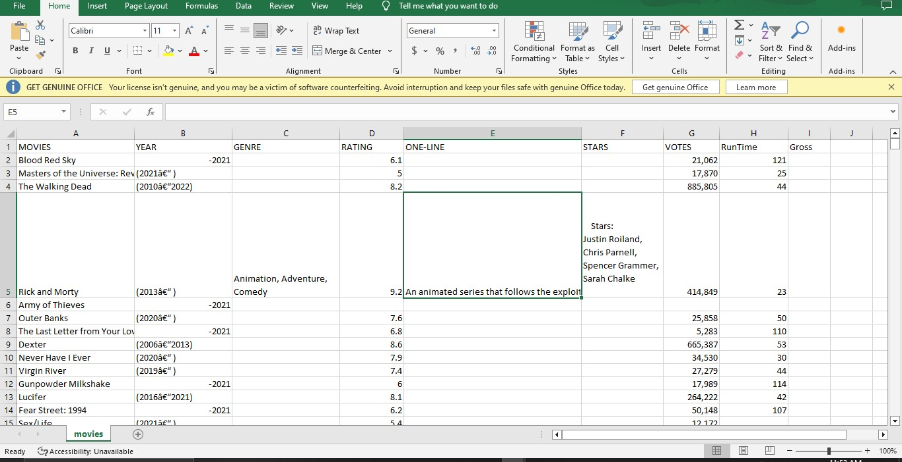
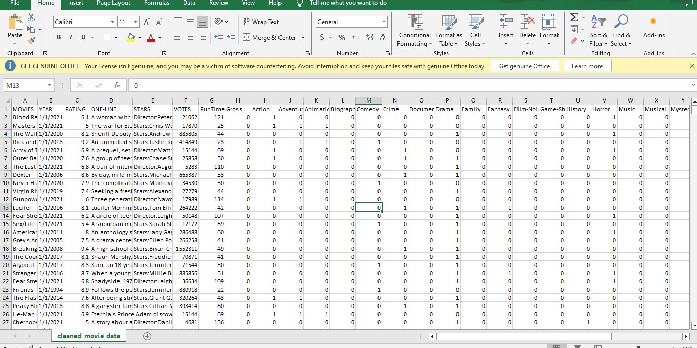

# Data-Cleaning-Using-Python
### Hello Datafam, I just cleaned one of the dirtiest data you can find on the internet. I am super excited to walk you through the process 

## How i did this  

Before Cleaning                      |                   After Cleaning  
:----------------------------------: |    :----------------------------------------------:
             |            
                          
#### _Kindly click on the image to view_
---
### INTRODUCTION 
#### What is Data Cleaning?
Data cleaning is one of the most important steps to take before the analysis process begins. It is the process that can make or mar your analysis. safe to say, a dirty data cannot produce a clean analysis.
Data cleaning is the process of identifying, correcting, or removing errors, inconsistencies, and inaccuracies in data in order to improve its quality and ensure the data is accurate and reliable for analysis. Here, i choose to use Python because of the various libraries and tools that can be used for data cleaning. Stay with me and grab a snack!

#### Aim Of This Project:
As a data analyst or a data scientist, you spend most of the time cleaning your data, this is right because they never come in the way we dream of. They are often raw, dirty, and full of garbage. This is why in this project, I would like to show how I clean dirty datasets with Python libraries. 

---

### SKILLS DEMONSTRATION 
In the course of this project, I was able to show important data-cleaning processes. 

- DATA SOURCING: This is the process of acquiring your data either from the cloud storage, from the internet or from your portable storage and machines
- DATA HANDLING: This is the process of importing your flat file into the notebook. 
- DATA PREPROCESSING: This is a process of skimming through the data, looking at the characteristics, and identifying the errors in the data. 

---

### DATA SOURCE | SUMMARY
This dataset was obtained from kaggle.com and was scrapped off imdb top Netflix and TV shows. it contains 9 columns and about 9999 rows. This data is completely raw.

---

### DATA CLEANING PROCESS
These are the processes I carried out in the course of this project.

- Import the libraries
- Load the data
- Check for Null Values
- Drop or Replace Nulls
- Check and convert datatype
- Check for Duplicates
- Drop duplicates
- Check for string inconsistency
- Check for whitespaces and irrelevant punctuations.

---

Kindly check the full details of my project [here](https://github.com/khrixres01/Data-Cleaning-Using-Python/blob/main/data%20cleaning%20with%20python%20.ipynb)

---

## Thank You for Following Through!

